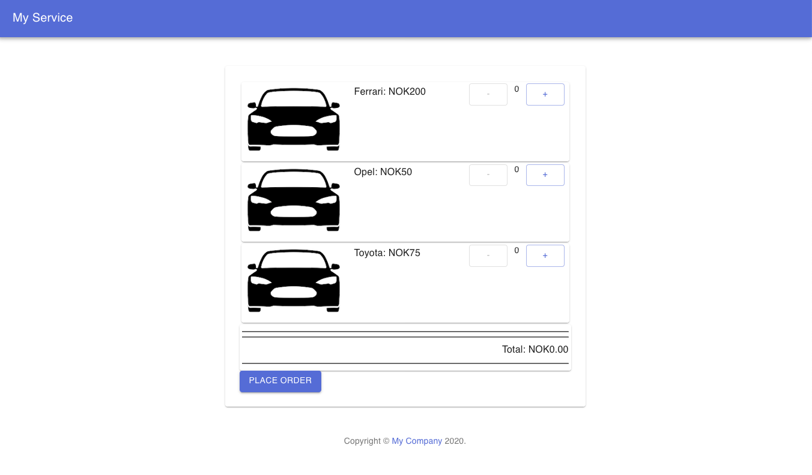
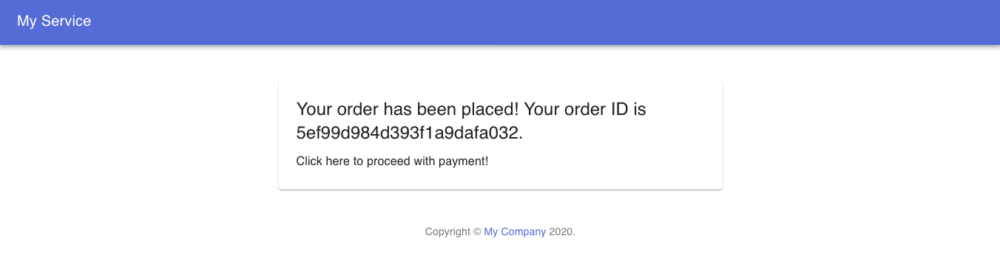
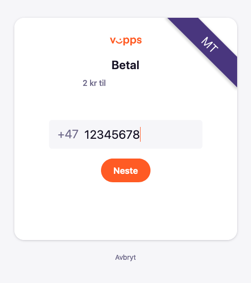
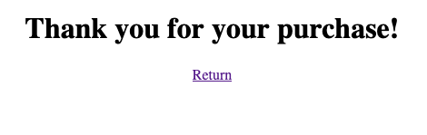

# VIPPS PAY DEMO

This application provides a demo for integrating Vipps payment through the use of the REST API service module 'vipps-client-web'.

The ['vipps-client-web'](../library/README.md) module wraps necessary Vipps (ecom) API calls to provide for initiating online transactions using Vipps;
handling order confirmation or cancellation callbacks and other endpoints required to integrate this third party service.

See the [README](../library/README.md) for further details on the 'vipps-client-web' module!

    There are further requirements for a working integration between the 'vipps-client-web' module and the Vipps service.
    You can find more information on these requirements in the previously mentioned README.

## Demo Content

This demo application contains two main components - a React frontend, implementing a quick-and-dirty shopping cart,
and a Spring Boot REST service, serving endpoints for some simple product and order maintenance.

### Disclaimer
Both components have been provided for the purpose of demoing a working prototype, and should by no means be considered complete nor optimal.
Though they should provide you with a working payment application, special consideration should be taken to ensure that you implement
sufficient measures to secure your application against attacks (see the [OWASP](https://owasp.org/www-project-web-security-testing-guide/) guide for more information).

### The Order and Product repository

To provide a basic storage for products and orders, the application uses a MongoDB database accessed using the
[MongoRepository](https://docs.spring.io/spring-data/mongodb/docs/current/api/org/springframework/data/mongodb/repository/MongoRepository.html) interface.
The two collections 'orders' and 'products' are populated based on the document objects implemented in Order and Product.

There are available endpoints for listing products and orders, as well as finding named instances of each type.
There are also endpoints for creating products and orders - each taking an object parameter which may be fitted to your own needs.


## Running the application

The application launches as any Spring Boot application. In the application directory run:

```$ mvn spring-boot:run```

## Data Repositories

The demo application handles product- and order storage by means of a mongoDB repository.
To install the latest mongoDB community version, follow the instructions on https://docs.mongodb.com/manual/administration/install-community/.

For installation on macOS:

```
# brew tap mongodb/brew
```

```
# brew install mongodb-community@4.2
```

Start and stop the service:

```
# brew services start mongodb-community
```

```
# brew services stop mongodb-community
```

For installations on other systems, please refer to any friendly online guide.

### Create a DB user

For demoing purposes, we will be using the database 'vipps_demo'.

```
> use vipps_demo
```

For this demo, we will create a simple user 'demo' with the following configuration:

```
> db.createUser({
    "user" : "demo",
    "pwd": "demo",
    "roles" : [
        {
            "role" : "readWrite",
            "db" : "vipps_demo"
        }
    ],
    "mechanisms" : [
        "SCRAM-SHA-1",
        "SCRAM-SHA-256"
    ]
})
```

### Connection String

The application utilizes the [MongoRepository](https://docs.spring.io/spring-data/mongodb/docs/current/api/org/springframework/data/mongodb/repository/MongoRepository.html)
interface class for convenient CRUD access. The interface will look for a connection uri either specified as an environment variable `SPRING_DATA_MONGODB_URI`
or as an application.properties property `spring.data.mongodb.uri`.

Expected notation value is `mongodb://<user>:<password>@<host>:<port>/<database>`

    Note that a production copy of your code shall not contain any secrets - including the DB username and password!
    It is highly recommended you keep your secrets well protected and out of reach for the public.

An undefined connection string indicates the use of localhost as DB provider.

For unit testing, we use in-memory instances.  

### The application landing page

This application hosts a very simple landing page, which will (provided you have configured and populated a product database)
present a list of products for purchase. The landing page implements a very simple shopping basket, which will allow you to
add and remove products to purchase.



### Processing an order

Pressing the "Place Order" button, will compile any products added to the 'shopping cart' into a PaymentRequestDTO object,
which will be processed in the 'PaymentService' service module for order placement - technically Vipps requires a mobile number,
an order ID, an amount to be processed, and a descriptive transaction text.

The PaymentService module may be suited to your own system, but should essentially function as a connection between
your local product repository, and the 'vipps-web-client' service module.
The PaymentService module will subsequently call to initiate payment.


    NOTE! Vipps handles orders in Norwegian øre (NOK/100). For the sake of this demo,
    we will not do any currency conversion.
    Any orders placed in Vipps will therefore be 100th of the value displayed on the order page;
    Also note that there is a lower order threshold in the 'vipps-web-client', at NOK2.00 (200 øre),
    which will reject any attempt at placing an order below this limit.

#### Successful payment initialisation

A successful payment initialisation with Vipps will return an order ID and an url for payment processing:



Following the link will redirect the user to the Vipps landing page:



On clicking 'Neste' (Next), the user will be requested to complete the payment using the Vipps application:


Once the payment has been accepted, the user is redirected back to the application, through the 'fallback url' provided
(see the configuration section in the 'vipps-web-client' README for details):



    Cancellation and payment failure is not supported in this demo, but should be handled through callbacks.
